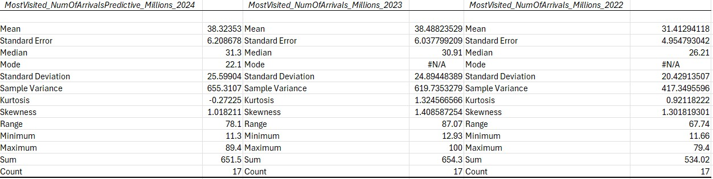
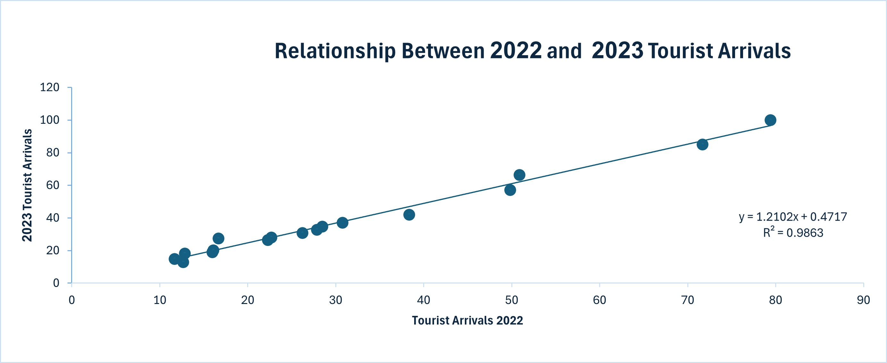

# MIS-311
## Introduction to Business Analytics
*Data Analysis and Insight*

# Global Tourism Trends Analysis (2022–2024)
### **Data Overview**  
- Source of data: Tourism dataset compiled from publicly available tourism statistics and World Bank international arrivals data.
- Number of rows: 206 rows
- Number of columns: 6 columns

### Context of the Dataset

This dataset contains tourism-related information about the most visited countries in the world, including international tourist arrivals, predicted visitor numbers for 2024, historical arrivals from 2022–2023, and World Bank tourism data.

The analysis aims to identify global tourism trends, compare country performance, and generate meaningful business insights using Exploratory Data Analysis (EDA).

### **Data Cleaning**
Before conducting the analysis, the dataset was checked for missing values, duplicate rows, and formatting issues to improve data quality and reliability.

 * Missing Values:

A total of **501 missing values** were identified across several columns in the dataset. These missing values were reviewed and handled appropriately during the cleaning process to minimise their impact on the analysis.

 * Duplicate Rows:

A total of **3 duplicate rows** were identified and removed to ensure consistency and accuracy in the dataset.

 * Data Types:

- **Numerical columns:** Tourist arrivals data  
- **Categorical column:** Country names
  
 * Outlier Analysis

Countries such as France, Spain, and the United States showed unusually high tourist arrival values compared to other countries in the dataset. These outliers were retained because they represent actual tourism patterns.

### Data Cleaning Summary
After cleaning and preprocessing, the final dataset contained 17 rows and 6 columns ready for analysis.

### **Descriptive Statistics**  

The average number of international tourist arrivals increased from **31.41 million in 2022** to **38.49 million in 2023**, indicating a strong recovery in global tourism. The predicted average for 2024 remains high at approximately **38.32 million visitors**, suggesting continued tourism growth worldwide.

- **Insight 1** 
The chart highlights the top predicted tourist destinations in 2024 based on international tourist arrivals.

France was predicted to attract the highest number of international tourists in 2024, followed by Spain and the United States. This suggests that countries with strong tourism infrastructure, famous attractions, and global popularity continue to dominate the global tourism industry. These insights may help tourism businesses and governments improve planning, marketing strategies, and tourism services.

- **Insight 2:**  Strong Correlation Between 2022 and 2023 Tourist Arrivals

The scatterplot shows a strong positive relationship between tourist arrivals in 2022 and 2023. Countries with high visitor numbers in 2022 generally continued to attract many tourists in 2023, indicating a steady recovery in global tourism after COVID-19. These findings can help businesses and policymakers better predict future tourism demand and prepare tourism services more effectively.

  

### Regression Analysis
**Regression Equation:**  

 y = 1.2102x + 0.4717

The regression coefficient indicates that for every additional 1 million tourist arrivals in 2022, tourist arrivals in 2023 increased by approximately 1.21 million. This suggests that tourism demand not only recovered after 2022 but continued to grow strongly in 2023.

**Coefficient of Determination (R²):**  

 R² = 0.9863

### Key Observations
- Countries with high tourist arrivals in 2022 also remained popular destinations in 2023.
- Most data points are closely grouped around the trend line, showing a consistent growth pattern across countries.
- Only small deviations from the trend line are observed, suggesting stable tourism growth overall.

### Implications Of The Findings

The findings show that global tourism is recovering strongly after COVID-19, especially in countries like France, Spain, and the United States, which continue to attract many international tourists. The increase in tourist arrivals from 2022 to 2023 and the high predicted tourist arrivals for 2024 suggest that tourism demand will continue to grow. These insights can help governments and tourism businesses improve planning, marketing, and tourist services.

This project also reflects my personal interest in finance and business analytics. I enjoyed combining data analysis, visualisation, and business thinking to explore real-world tourism trends in a more creative and meaningful way. The portfolio highlights both my analytical skills and my curiosity about how data can support better business decisions.
