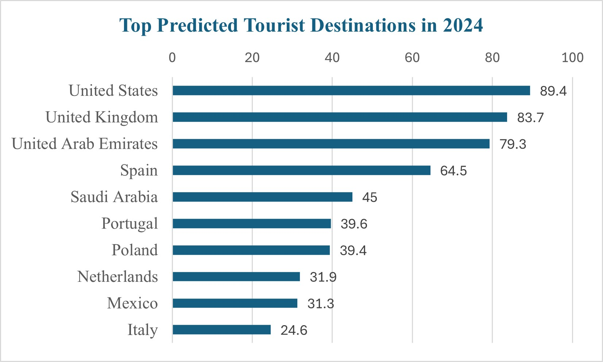

# MIS-311
## Introduction to Business Analytics
*Data Analysis and Insight*
### **Data Overview**  
- Source of data: Tourism dataset compiled from publicly available tourism statistics and World Bank international arrivals data.
- Number of rows: 206 rows
- Number of columns: 6 columns
The context: This dataset contains tourism-related information about the most visited countries in the world, including international tourist arrivals, predicted visitor numbers for 2024, historical arrivals from 2022–2023, and World Bank tourism data. The analysis aims to identify global tourism trends, compare country performance, and generate meaningful business insights using Exploratory Data Analysis (EDA).

### **Data Cleaning**
Before conducting the analysis, the dataset was checked for missing values, duplicate rows, and formatting issues to improve data quality and reliability.

 *  Missing Values
A total of **501 missing values** were identified across several columns in the dataset. These missing values were reviewed and handled appropriately during the cleaning process to minimise their impact on the analysis.

 * Duplicate Rows
A total of **3 duplicate rows** were identified and removed to ensure consistency and accuracy in the dataset.

 * Data Types
- Numerical columns: tourist arrivals data
- Categorical column: country names
  
 * Outlier Analysis
- Some countries, especially the United States and the United Kingdom, showed unusually high tourist arrival values compared to others. These outliers were kept as they reflect actual tourism patterns.

### Data Cleaning Summary
- The dataset contained 501 missing values and 3 duplicate rows.
- Duplicate rows were removed during preprocessing.
- After cleaning, the final dataset consisted of 18 rows and 6 columns ready for analysis.
### **Descriptive Statistics**  

The average number of international tourist arrivals increased from **31.41 million in 2022** to **38.49 million in 2023**, indicating a strong recovery in global tourism. The predicted average for 2024 remains high at approximately **38.32 million visitors**, suggesting continued tourism growth worldwide.

## Insight 1
The chart highlights the top predicted tourist destinations in 2024 based on international tourist arrivals.

The United States is predicted to attract the highest number of international tourists in 2024 with 89.4 million visitors, followed by the United Kingdom (83.7 million) and the United Arab Emirates (79.3 million).  

Spain also records strong tourism demand with 64.5 million visitors, while Saudi Arabia, Portugal, and Poland continue to grow as important destinations.  

Meanwhile, the Netherlands, Mexico, and Italy are predicted to receive lower visitor numbers compared to the leading countries, showing that global tourism demand is concentrated among a few major destinations.

